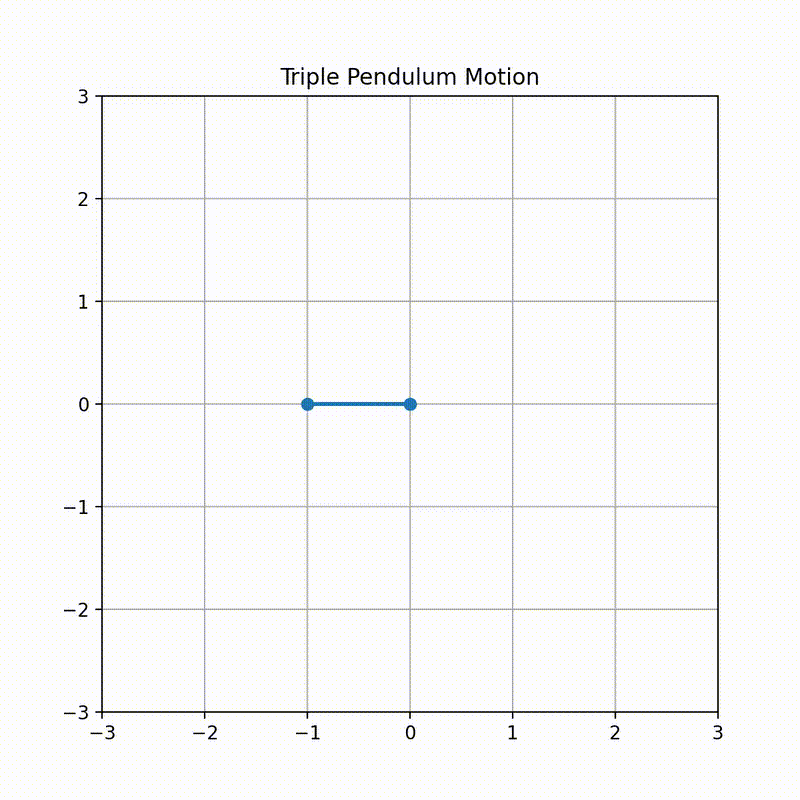

# Guiding Trajectory Generator

A modular Python framework for generating guiding trajectories for multi-link pendulum systems.

Python + C++ hybrid simulation for multi-link pendulum dynamics and trajectory generation.

## Features
- Config-driven trajectory generation (YAML)
- Triangle-wave motion profiles
- Forward kinematics (angles → positions)
- Experiment-based pipeline
- CSV export of trajectories

## Project Structure
configs/        # system + motion configs
experiments/    # experiment scripts
src/            # core modules

## Example
python -m experiments.generate_reach_floor

## 🎥 Demo

